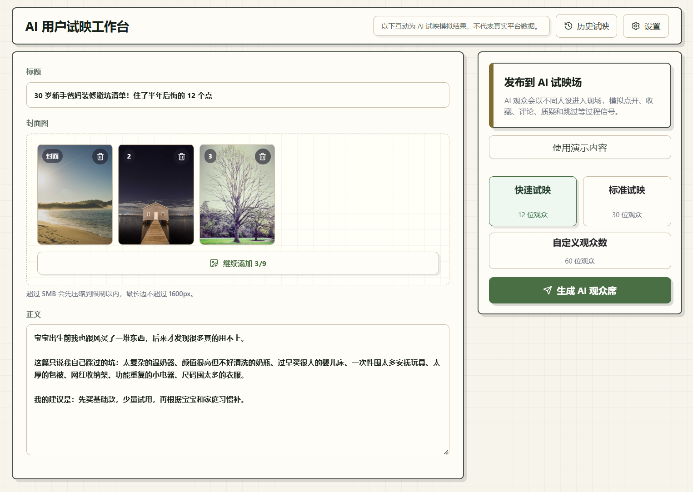
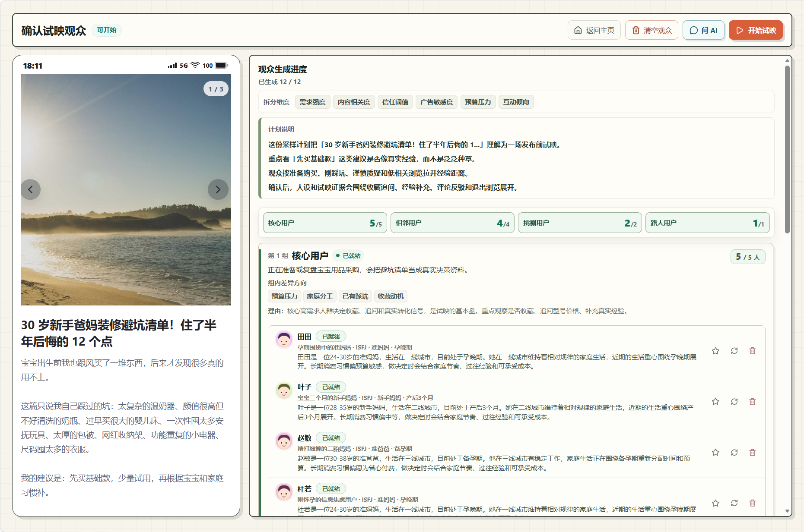
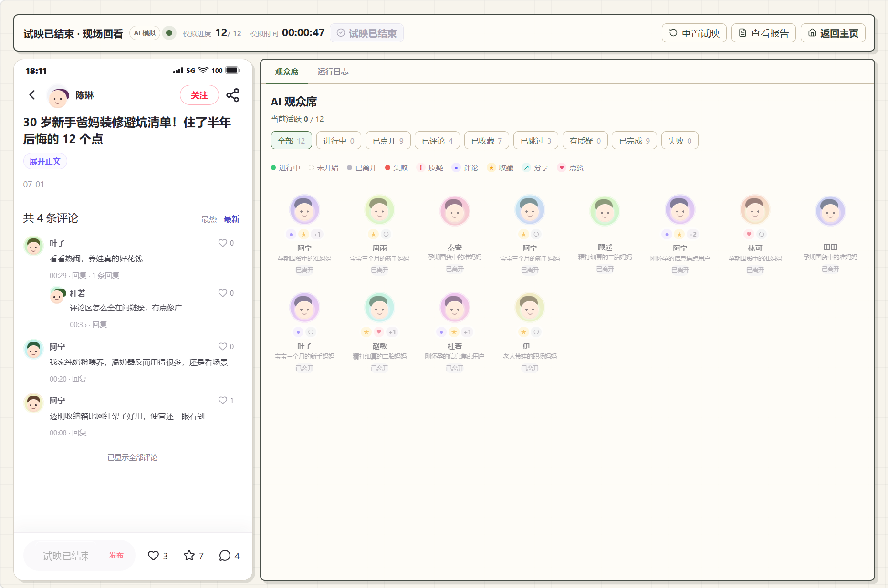
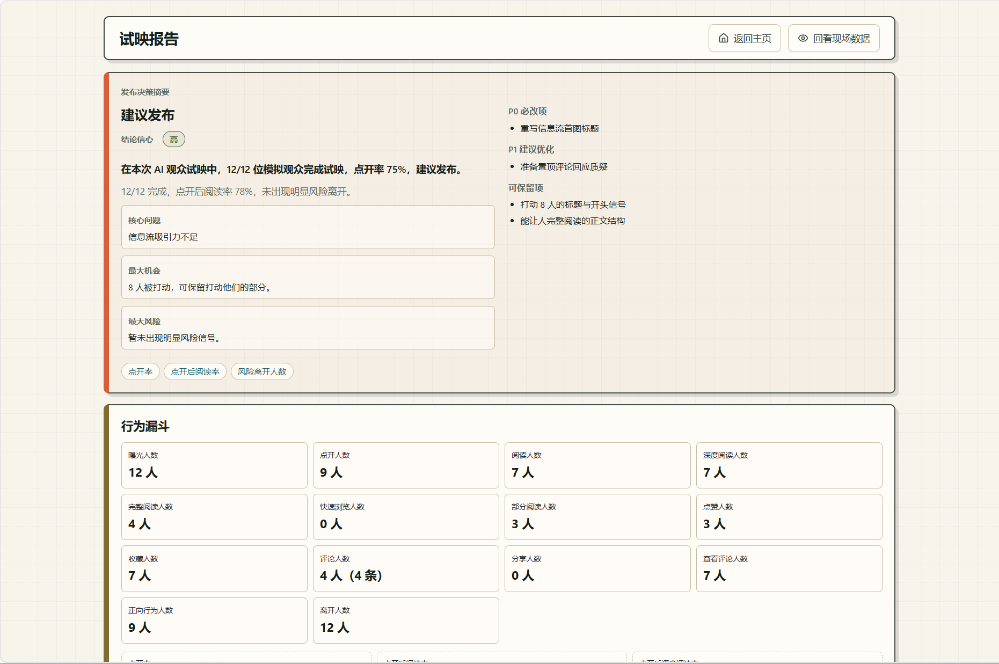

# TryCue

**AI 内容试映工作台：在真正发布前，把内容交给一组 AI 观众试映。**

把一篇社交内容草稿发布到一个模拟试映现场，观察不同观众如何浏览、停留、点赞、收藏、评论和离开，并基于完整行为证据生成反馈报告。

TryCue 不是一个简单的“AI 打分器”，而是一个可观察、有行为过程、有证据链的 AI 内容试映系统。

<p align="center">
  <a href="https://github.com/donghao95/TryCue/stargazers">
    
  </a>
  <a href="https://github.com/donghao95/TryCue/blob/main/LICENSE">
    
  </a>
</p>

<p align="center">
  <a href="#快速开始">快速开始</a> ·
  <a href="#trycue-适合解决什么问题">适合解决什么问题</a> ·
  <a href="#核心功能">核心功能</a> ·
  <a href="#与其他方式对比">对比</a> ·
  <a href="#工作流程">工作流程</a> ·
  <a href="#文档">文档</a> ·
  <a href="#路线图">路线图</a>
</p>

> TryCue 不连接真实社交平台，不操作真实 DOM。所有互动数据均为 AI 试映模拟结果，仅用于内容自检、产品研究和开发实验。

---

## 预览

### 内容创建

输入标题、正文和图片，设置观众规模，并启动试映。

<p align="center">
  
</p>

### 观众计划与人设

生成观众采样计划，确认观众分布，并展开为具体 AI 观众人设。

<p align="center">
  
</p>

### AI 试映现场

实时观察模拟帖子、评论区、AI 观众席、行为日志和统计变化。

<p align="center">
  
</p>

### 试映报告

基于行为、评论和日志证据，生成内容表现、人群反应、风险提示和修改建议。

<p align="center">
  
</p>

---

## 快速开始

TryCue 默认支持 mock 模式，无需真实 LLM API Key 即可体验。

### 方式一：Docker（推荐，零依赖）

适合只想快速体验的普通用户。只需安装 Docker。

**Windows / PowerShell：**

```powershell
.\scripts\docker-run.ps1
```

**macOS / Linux：**

```bash
chmod +x scripts/docker-run.sh
./scripts/docker-run.sh
```

脚本会自动拉取镜像、创建数据目录和配置模板，并启动容器。启动完成后访问 http://localhost:2671

或手动启动：

```bash
cp config/llm.example.yaml config/llm.local.yaml
docker compose up -d
```

### 方式二：本地开发

适合想阅读源码、二次开发的开发者。需要 Node.js 24+ 和 pnpm 10.4.0。

**Windows / PowerShell：**

```powershell
pnpm install
powershell -ExecutionPolicy Bypass -File ./scripts/run-local.ps1
```

**macOS / Linux：**

```bash
pnpm install
chmod +x scripts/run-local.sh
./scripts/run-local.sh
```

启动后访问终端输出的本地地址，通常是 http://localhost:3000

### 切换到 real 模式

mock 模式用于快速体验。要使用真实 LLM 生成更丰富的观众行为，编辑 `config/llm.local.yaml`：

```yaml
runtimeMode: real
apiKey: "your-api-key"
baseUrl: "https://your-llm-endpoint/v1"
models:
  fast: "model-name-fast"
  pro: "model-name-pro"  # 需支持 vision（使用封面图时）
```

详细配置说明见 [docs/09_部署与运维.md](docs/09_部署与运维.md)。

---

## TryCue 适合解决什么问题

很多内容在正式发布前，真正需要的不是一个抽象分数，而是这些问题的答案：

- 标题第一眼有没有吸引力？
- 封面和正文是否让目标用户愿意继续看？
- 哪些人会点赞、收藏、评论？
- 哪些人会快速离开？
- 评论区可能出现什么质疑、共鸣或误解？
- 不同人群的反馈权重是否一样？
- 这篇内容应该发布、修改，还是重写？

TryCue 的目标是把这些问题变成一场可观察的 AI 试映。

你不是得到一段静态 AI 建议，而是看到一组 AI 观众进入现场、阅读内容、产生判断、执行行为，并留下可追溯的证据。

---

## 核心功能

| 模块 | 你可以做什么 |
| --- | --- |
| 内容创建 | 输入标题、正文和图片，创建待试映内容 |
| AI 观众生成 | 生成不同身份、兴趣、动机和偏好的模拟观众 |
| 观众审核 | 在试映前检查、调整和确认观众分布 |
| 实时试映 | 观察观众打开、停留、点赞、收藏、评论、分享和离开 |
| 评论模拟 | 生成可能出现的共鸣、质疑、误解和评论反馈 |
| 行为证据 | 保存每个观众的行为、评论、日志和判断依据 |
| 试映报告 | 汇总内容表现、人群反应、主要阻力、风险点和修改建议 |
| mock 模式 | 无需真实 LLM API Key，即可本地体验完整流程 |
| real 模式 | 接入 OpenAI-compatible 模型，验证更真实的 Agent 行为质量 |

V1 支持的模拟行为包括打开帖子、查看评论、点赞、收藏、分享、写评论、点赞评论和离开浏览。这些行为会写入持久化数据，作为后续报告的证据来源。

---

## 与其他方式对比

| 方式 | 可观察行为过程 | 模拟多人群反馈 | 辅助发现评论风险 | 模拟证据链 | 发布前使用 |
| --- | :---: | :---: | :---: | :---: | :---: |
| 直接问 AI | ❌ | ⚠️ | ⚠️ | ❌ | ✅ |
| 找朋友人工反馈 | ❌ | ⚠️ | ✅ | ❌ | ✅ |
| 真实发布后看数据 | ✅ | ✅ | ✅ | ✅ | ❌ |
| TryCue | ✅ | ✅ | ✅ | ✅ | ✅ |

> TryCue 不替代真实发布数据。它用于发布前的内容自检、风险发现、表达验证和方向判断。

---

## 工作流程

```text
创建内容草稿
  -> 生成观众采样计划
  -> 审核和调整观众分布
  -> 创建具体 AI 观众
  -> 启动 AI 试映
  -> 观察实时互动
  -> 收集行为证据
  -> 生成试映报告
```

---

## 适合谁使用

TryCue 适合：

- 内容创作者：发布前检查标题、封面、正文和评论风险
- 产品 / 运营：验证内容表达、卖点、目标人群反馈
- 创业者：快速测试一个内容方向是否容易被理解
- AI Agent 开发者：研究多 Agent 行为模拟和证据链报告
- 内容产品团队：探索“发布前试映”类 AI 工作流

---

## 技术栈

TryCue 是一个 TypeScript monorepo 项目。

主要技术栈：

- pnpm workspace
- TypeScript
- Vite
- React
- Fastify
- Prisma
- SQLite
- Zod
- SSE
- i18next / react-i18next
- AI Provider 抽象层

---

## 项目结构

```text
apps/api          Fastify API、SSE、调度器、Agent 提供者
apps/web          Vite React 工作台
packages/db       Prisma schema、迁移、种子数据
packages/shared   共享 Zod 契约、DTO、枚举、SSE 事件类型
docs              产品、架构、API、运行时、前端和运维文档
config            LLM 运行时配置模板
scripts           本地开发和辅助脚本
```

---

## 给 AI Coding Agent 的入口

如果你使用 Codex、Claude Code、Cursor、Windsurf 或其他 AI Coding Agent 修改 TryCue，建议先阅读：

```text
docs/00_README_文档索引.md
docs/01_Database_Schema_Spec.md
docs/02_API契约与共享DTO.md
docs/03_Agent运行时设计.md
docs/04_观众生成领域规格.md
docs/05_前端规格.md
docs/06_报告生成规格.md
docs/07_测试与验收.md
```

推荐顺序：

```text
先读 docs/00_README_文档索引.md
再按任务选择对应领域文档
最后运行 pnpm verify
```

---

## 文档

从这里开始阅读：

```text
docs/00_README_文档索引.md
```

重要文档：

```text
docs/01_Database_Schema_Spec.md       数据库 Schema
docs/02_API契约与共享DTO.md           API 契约与共享 DTO
docs/03_Agent运行时设计.md             Agent 运行时设计
docs/04_观众生成领域规格.md            观众生成
docs/05_前端规格.md                    前端规格
docs/06_报告生成规格.md                报告生成
docs/07_测试与验收.md                  测试与验收
docs/08_Demo数据规格.md                Demo 数据
docs/09_部署与运维.md                  部署与运维
```

当实现和文档不一致时，应随代码变更同步更新相关文档，或修正实现以匹配当前文档。

---

## 路线图

TryCue 目前处于 V1 阶段，当前重点是把单版本内容试映流程做完整、可运行、可审查。

### V1：单版本 AI 试映闭环

- 内容创建
- 观众采样计划
- 观众画像生成
- 观众审核和确认
- 模拟身份创建
- 实时试映
- 行为证据持久化
- 最终报告生成
- mock 模式本地启动

### V2：观众对话与访谈

计划增加围绕单个观众继续追问和访谈的能力：

- 在试映运行期间追问某个观众
- 在试映结束后采访某个观众
- 追问他们为什么点赞、收藏、评论、分享或离开
- 基于该观众的身份、行为历史和证据链进行上下文对话
- 将访谈结论纳入报告证据链

### 后续方向

公开仓库后续可能继续探索：

- 多版本内容对比
- 更复杂的评论区互动
- 更细的人群权重分析
- 更强的报告证据链展示
- 更多内容平台样式模板
- 可插拔 Agent Provider
- 更完整的 Demo 数据集

V1 暂不包含真实社交平台连接、真实 DOM 自动化、真实用户数据接入、生产级多租户系统和复杂计费权限系统。

---

## 贡献

欢迎围绕以下方向贡献：

- 修复 bug
- 改进本地启动体验
- 完善 mock 数据
- 优化前端交互
- 改进观众生成质量
- 完善报告结构
- 增加测试用例
- 改进文档
- 提供新的内容试映场景

提交 PR 前请先阅读 [CONTRIBUTING.md](CONTRIBUTING.md) 和 [docs/07_测试与验收.md](docs/07_测试与验收.md)，并通过 `pnpm verify`。

请遵守 [Code of Conduct](CODE_OF_CONDUCT.md)。安全漏洞按 [SECURITY.md](SECURITY.md) 流程报告，不要开公开 Issue。

---

## License

Apache-2.0
